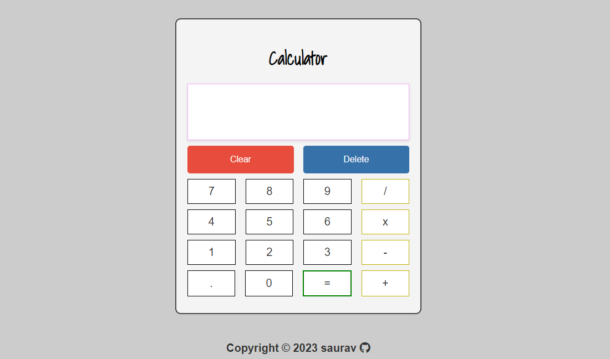

# calculator.js
Calculator Made using Javascript, HTML and CSS

## Preview

## Features
* Keyboard Typing Supported
* Device Responsive

## Credits
* [icon-icons.com](https://icon-icons.com/) for favicon
* [Font Awesome](https://fontawesome.com/) [CDN link is included in `index.html`]

## License
This project is licensed under the [MIT License](https://choosealicense.com/licenses/mit/).
